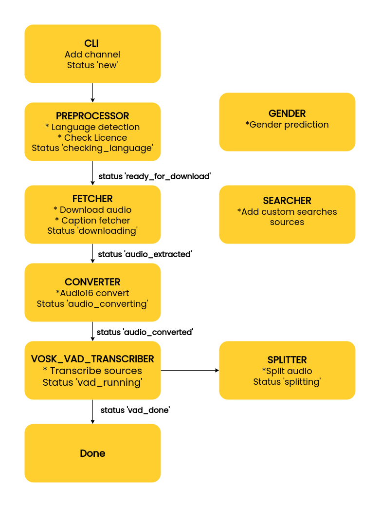

## About

Datapipe is a data processing pipeline that (currently) extracts audio clips from youtube videos and generates two transcription candidates with a Vosk (Kaldi) and a Wav2Vec2 model. The goal of the software is to ease the generation of datasets for ASR by automatically extracting and processing large audio sources.

### Datapipe workflow


## Setup cluster

Install k3s

```bash
curl -sfL https://get.k3s.io | sh -s - --write-kubeconfig-mode 644
# Check for Ready node,takes maybe 30 seconds
k3s kubectl get node
#Create alias for Kubectl
mkdir -p ~/.kube/ && sudo  cp /etc/rancher/k3s/k3s.yaml ~/.kube/config && 
sudo chown $USER:$USER ~/.kube/config && chmod 600 ~/.kube/config && export KUBECONFIG=~/.kube/config
```
Install kustomize
```bash
curl -s \
"https://raw.githubusercontent.com/kubernetes-sigs/kustomize/master/hack/install_kustomize.sh"  | bash  && \
sudo mv kustomize /usr/local/bin/
```
Create namespace
```bash
kubectl create namespace assistent
```
Encode secret password
```bash
#Get BASE64 encoded password
echo -n "password123#$" | base64 -i -
```

Create secret file and paste encoded password (k8s/postgresql/secret.yaml)
As a recommendation keep POSTGRES_USER variable set to default (datapipe)
```yml
apiVersion: v1
kind: Secret
metadata:
  namespace: assistent
  name: datapipe-db-secret
data:
  POSTGRES_USER: "ZGF0YXBpcGU="
  POSTGRES_PASSWORD: "cGFzc3dvcmQxMjMjJA=="
```

[//]: # (## Setup database)

[//]: # (Install krew package manager)

[//]: # (https://krew.sigs.k8s.io/docs/user-guide/setup/install/)

[//]: # ()
[//]: # (Install schemahero)

[//]: # (```bash)

[//]: # (kubectl krew install schemahero)

[//]: # (kubectl schemahero install)

[//]: # (```)
## Deployment
```bash
make deploy 
```

## Start using datapipe

Access to any pod that was set up using paulandrei/datapipe image (example: converter-, fetcher-.. )
```bash
kubectl -n assistent exec -it fetcher-YOUR_POD_ID bash
```
Using the cli add new channel
```bash
python -m cli add-channel https://www.youtube.com/user/gencat/
```
## Setup development environment

Okteto allows you to develop inside a container. When you run okteto up your Kubernetes deployment is replaced by a development container that contains your development tools.
[Learn more about Okteto](https://github.com/okteto/okteto#how-it-works)

Install okteto
```bash
curl https://get.okteto.com -sSfL | sh
```

In the case that your cluster setup is not local, please set the KUBECONFIG env variable to the path of your kube config file.
```bash
#Example for setting KUBECONFIG generated by goteleport to access remote cluster
export KUBECONFIG=${HOME?}/teleport-kubeconfig.yaml
```
If you are using a local cluster setup then run next command

```bash
mkdir -p ~/.kube/ && sudo  cp /etc/rancher/k3s/k3s.yaml ~/.kube/config && 
sudo chown $USER:$USER ~/.kube/config && chmod 600 ~/.kube/config && export KUBECONFIG=~/.kube/config
```
Select and start development container
```bash
okteto up
```

## Authors

- [Ciaran O'Reilly](https://github.com/ccoreilly)
- [Paul Andrei](https://github.com/PaulNdrei)

## License

Licensed under the GNU Affero General Public License v3.0. [Copy of the license](LICENSE)

This tool was initially built by the community and its further development and maintanence is being funded by the [Catalan Ministry of the Vice-presidency, Digital Policies and Territory of Generalitat](https://politiquesdigitals.gencat.cat/en/inici/index.html) within the framework of the [Aina project](https://politiquesdigitals.gencat.cat/ca/tic/aina-el-projecte-per-garantir-el-catala-en-lera-digital/).